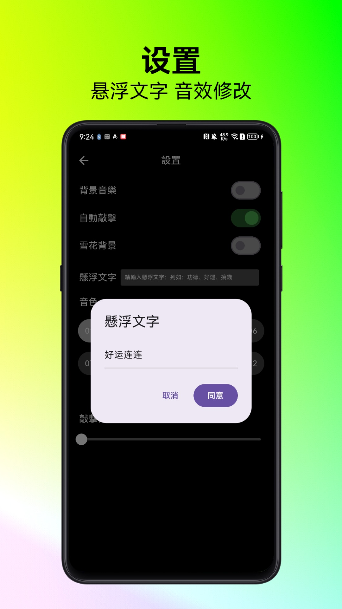

# 木鱼
在佛教修行中，木鱼是一种常用的传统辅助工具，用于帮助修行者专注和保持节奏

## 项目截图

| 	 | 	 |   | 	 | 
|--------------------------------------------------------------|------------------------------------------------------------|------------------------------------------------------------|------------------------------------------------------------|
| 	   | 	 | 	 | 	 | 	 	                                      
